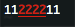

# ansi-escape
ANSI escape codes for manipulating the terminal

[](https://www.npmjs.org/package/ansi-escape)
[](https://travis-ci.org/zoubin/ansi-escape)
[](https://david-dm.org/zoubin/ansi-escape)
[](https://david-dm.org/zoubin/ansi-escape#info=devDependencies)

## Usage

```javascript
var csi = require('ansi-escape')

console.log('1'.repeat(8))
console.log(
  csi
    // underline text
    .underline

    // red text
    .red

    // move cursor one line up
    .cursorUp

    // move cursor 2 cells forward
    .cursorForward(2)

    // the text to be escaped
    .escape('2'.repeat(4))
)

```

Output:



## Cursors

### cursorUp(n = 1)
### cuu(n = 1)
### up(n = 1)

Moves the cursor `n` cells up.

### cursorDown(n = 1)
### cud(n = 1)
### down(n = 1)

Moves the cursor `n` cells down.

### cursorForward(n = 1)
### cuf(n = 1)
### forward(n = 1)

Moves the cursor `n` cells forward.

### cursorBackward(n = 1)
### cub(n = 1)
### back(n = 1)

Moves the cursor `n` cells backward.


### cursorColumn(n = 1)
### cha(n = 1)
### col(n = 1)

Moves the cursor to column `n`.

### cursorPosition(n = 1, m = 1)
### cup(n = 1, m = 1)

Moves the cursor to row `n`, column `m`.

### eraseDisplay(n = 0)
### eraseDisplayEnd
### eraseDisplayStart
### eraseDisplayEntire

Clears part of the screen.

* If `n` is 0 (or missing), clear from cursor to end of screen.
* If `n` is 1, clear from cursor to beginning of the screen.
* If `n` is 2, clear entire screen (and moves cursor to upper left on DOS ANSI.SYS).

### eraseLine(n = 0)
### eraseLineEnd
### eraseLineStart
### eraseLineEntire

Erases part of the line.

* If `n` is 0 (or missing), clear from cursor to the end of the line.
* If `n` is 1, clear from cursor to beginning of the line.
* If `n` is 2, clear entire line.

Cursor position does not change.

### scrollUp(n = 1)
### su(n = 1)

Scroll whole page up by n (default 1) lines.
New lines are added at the bottom. 

### scrollDown(n = 1)
### sd(n = 1)

Scroll whole page down by n (default 1) lines.
New lines are added at the top.

### saveCursorPosition
### saveCursor
### scp

Saves the cursor position.

### restoreCursorPosition
### restoreCursor
### rcp

Restores the cursor position.

### hideCursor
### hide

Hides the cursor.

### showCursor
### show

Shows the cursor.

## Styles

### Modifiers

* bold
* dim
* italic
* underline
* blink
* inverse
* hidden
* strikethrough

### Colors

* black
* red
* green
* yellow
* blue
* magenta
* cyan
* white

### Background colors

* bgBlack
* bgRed
* bgGreen
* bgYellow
* bgBlue
* bgMagenta
* bgCyan
* bgWhite

